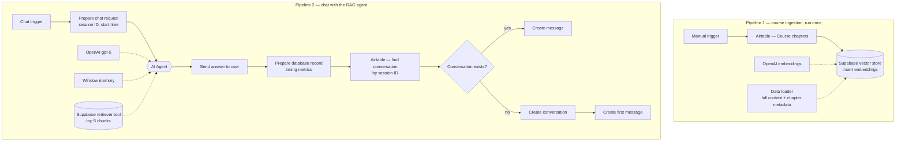

# Biology Course RAG Agent

   

An AI teaching assistant that answers questions about a biology course using **only** the course material stored in a vector database — and persists every conversation for later analysis.

The interesting part: this is really **two pipelines in one workflow** — one that ingests the course into the vector store, and one that serves students through a RAG agent.

canvas.png

## Tech stack

- **n8n** — workflow orchestration (AI Agent, Chat Trigger, branching)
- **OpenAI `gpt-5`** — chat model driving the agent
- **OpenAI Embeddings** — text → vectors, used at ingestion *and* at query time
- **Supabase Vector Store** — pgvector table (`documents`) holding the embedded course
- **Airtable** — source of the course content *and* persistence layer for conversations

## Architecture

## Pipeline 1 — Ingesting the course

Run once (manual trigger) to build the knowledge base:

1. **Airtable — Course chapters**: each record holds a chapter's full content and summary.
2. **Default Data Loader**: turns each record into a document, attaching `chapter` and `summary` as **metadata** — this is what later lets the agent cite the chapter it used.
3. **OpenAI Embeddings → Supabase**: every document is embedded and inserted into the `documents` pgvector table.

## Pipeline 2 — Answering students

1. **Chat Trigger** (public): greets the student — *"Hi there! I'm your teaching assistant in Biology."*
2. **Prepare chat request** (Set node): captures `Session ID`, `Start time` and the user message — groundwork for both persistence and performance metrics.
3. **AI Agent** orchestrates three attachments:
   - `gpt-5` as the chat model
   - **Simple Memory** (buffer window) for conversational context
   - **Supabase Vector Store as a tool** (`retrieve-as-tool`, top-5 chunks) — the agent *decides* when to retrieve
4. **Send answer** back to the chat.
5. **Prepare database record**: assembles the message, the answer, and a computed `Time to generate (ms)` performance metric.
6. **Airtable search → If → Create**: finds the conversation by session ID; creates the message under it, or creates the conversation first if it's the session's first message.

## The system prompt

Strict RAG behavior is enforced in the agent's system message. The key rules, verbatim from the workflow:

> - Do not answer course-related questions using your own knowledge.
> - For every course-related question, use the Supabase Vector Store tool before answering.
> - If the retrieved content is insufficient, clearly say that the course materials do not contain enough information.
> - For simple greetings such as "Hi" or "Thanks", respond naturally without using the tool.
> - Make one retrieval call first. Only make one additional call if the results are clearly insufficient.
> - Mention the chapter name when it is available in the metadata.

Two deliberate details: the **greeting exception** (no wasted retrieval on "hello"), and the **retrieval budget** (max two calls) that prevents the agent from looping on searches.

## Airtable data model

**Conversations**: `AI generated title` · `n8n session ID` (lookup key) · `Start time` · linked `Messages` + rollups (count, latest message time)

**Messages**: `Conversation` (linked) · `User message` · `AI answer` · AI-generated `Summary`/`Headline` · `Message time` · `Time to generate (ms)`

## Key concepts

**Retrieval-Augmented Generation.** The model retrieves relevant course chunks *before* answering instead of relying on its training data — accurate, updatable, explainable answers with far fewer hallucinations.

**Embeddings and semantic search.** Text becomes vectors that capture meaning; a question is embedded the same way, and similarity search returns the closest chunks. Question → embedding → top-5 similar chunks → answer.

**Retriever as a tool, not a step.** The vector store is attached to the agent as a *tool* it can choose to call — with prompt rules acting as the budget that keeps tool use disciplined.

**Metadata makes RAG explainable.** Storing `chapter` alongside each chunk at ingestion lets the agent answer "…as covered in the Genetics chapter."

**Conversation persistence.** Memory handles context inside a session; Airtable persists everything across sessions. The session-ID lookup with an If branch mimics the upsert pattern of production chat apps.

## Challenges encountered

- Configuring the Supabase vector store and its `documents` table
- Prompt engineering for *strict* RAG behavior (and stopping retrieval loops)
- Airtable linked records and the arrays they return in n8n expressions
- The "search may return nothing" case: the Airtable search node needs **Always Output Data** so the If node can test `!!$json.id` instead of the branch dying silently
- n8n expression syntax (`$('Node Name').item.json[...]` across branches)

## Try it yourself

1. Import [`workflow.json`](workflow.json) into n8n (Workflows → Import from file).
2. Reconnect your own credentials: OpenAI, Supabase and Airtable (credentials are never included in n8n exports).
3. Recreate the two Airtable tables (model above) and a Supabase `documents` table with the pgvector extension.
4. Run the ingestion pipeline once, then open the chat.

## Possible improvements

- Stream responses token by token
- Auto-generate conversation titles (the Airtable field is ready for it)
- Cite retrieved chunks explicitly in the answer
- User feedback (👍 / 👎) stored per message
- Analytics dashboard with Airtable Interfaces (avg generation time, questions per chapter)
- Semantic search over past conversations

---

*Built during Day 1 of Le Wagon's AI Product Builder module — [see all projects](../README.md).*
