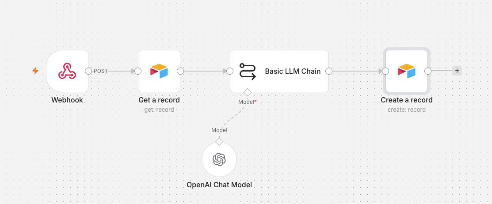
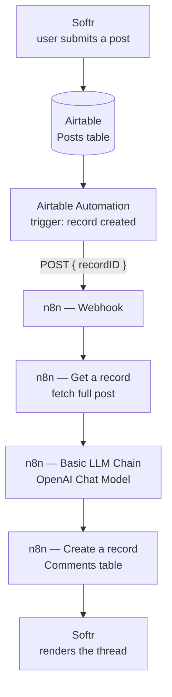
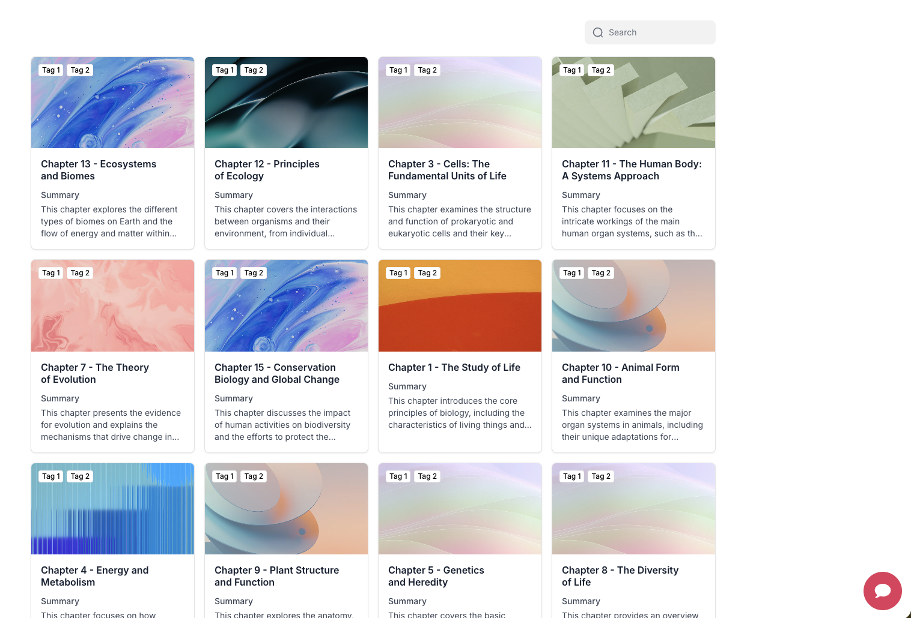

# AI Community Forum

An event-driven community forum where every new post automatically receives an AI-generated reply — built without a backend, using Airtable as the database, n8n as the automation layer, and Softr as the frontend.

Built during the **Le Wagon — AI Product Building** program.



---

## What it does

A student posts a question in the forum. Within seconds, an AI teaching assistant replies in the thread. No one clicks anything, no server is polled, and no custom backend exists.



The frontend does nothing intelligent. It renders a database. All logic lives in the automation layer.

---

## Stack

| Layer | Tool | Role |
|---|---|---|
| Frontend | Softr | Forms, list views, thread rendering |
| Database | Airtable | `Posts` and `Comments` tables, linked records |
| Automation | n8n | Webhook trigger, orchestration, data mapping |
| AI | OpenAI (via n8n Basic LLM Chain) | Generates the reply |

---

## Repository structure

```
.
├── README.md
├── LICENSE
├── n8n/
│   └── ai-forum-workflow.json      # Importable n8n workflow
├── airtable/
│   ├── schema.md                   # Tables, field types, relationships
│   └── automation-script.js        # "Run Script" action calling the webhook
└── docs/
    └── screenshots/
```

---

## Design decisions

### Events, not polling

The naive approach schedules n8n to check Airtable every minute. That means hundreds of requests a day where almost all of them return "nothing new", and a reply that can lag by a full interval.

Instead, Airtable notifies n8n the moment a record is created. One event, one request, near-instant reply. This is the pattern most production automations use.

### The payload carries identity, not content

The Airtable automation sends a single field:

```json
{ "recordID": "recXXXXXXXXXXXXXX" }
```

n8n then fetches the full record itself. Sending every field would tightly couple the two systems, transmit data that may already be stale, and break whenever the Airtable schema changes. Sending an ID does not.

### Basic LLM Chain over an AI Agent

Generating a forum reply is a one-shot transformation: prompt in, text out. No memory, no tools, no reasoning loop is needed. An AI Agent would add latency, cost, and failure modes for no benefit.

---

## How to run it

**Prerequisites:** an Airtable base, an n8n instance (cloud or self-hosted), an OpenAI API key, a Softr account.

1. **Airtable** — create the `Posts` and `Comments` tables following [`airtable/schema.md`](airtable/schema.md). Pay attention to field *types*: `Comment author` must be a Linked Record, not a text field.
2. **n8n** — import [`n8n/ai-forum-workflow.json`](n8n/ai-forum-workflow.json), add your Airtable and OpenAI credentials, then activate the workflow and copy the production webhook URL.
3. **Airtable Automation** — create an automation triggered by `When record is created` on `Posts`, add a `Run Script` action, paste [`airtable/automation-script.js`](airtable/automation-script.js), and set the `WEBHOOK_URL` constant. Declare an input variable `recordId` mapped to the trigger's Airtable record ID.
4. **Softr** — connect the Airtable base, build a form block writing to `Posts` and a list block reading `Comments`.
5. Post a question and watch the comment appear.

---

## The prompt

```text
You are an AI teaching assistant for an AI Product Building course.
A student posted the following question:

{{ $json.fields["Post content"] }}

Write a helpful, concise and accurate reply.
Keep the tone friendly and educational.
If relevant, include a practical example.
```

The Airtable field is injected at runtime through an n8n expression — the prompt is a template, not a static string.

---

## Things that cost me time

**Linked records store IDs, not text.** Airtable displays `AI Bot` but stores `recH8S6...`. The API expects an *array* of record IDs — `["recXXXX"]`, not `"recXXXX"` and certainly not `"AI Bot"`. The `RECORD_ID()` formula is the quickest way to surface those IDs in a view.

**Typecast converts values, not field types.** Enabling Typecast lets Airtable resolve a primary-field value into a linked record. It will not rescue a field that was created as Text when it should have been a Linked Record — that requires fixing the schema.

**Read the actual output before writing the expression.** I assumed `$json.chatInput` out of habit; the real path was `$json.fields["Post content"]`. One minute of reading the node output would have saved twenty minutes of debugging.

**Inspect Executions, not isolated nodes.** Testing a node in isolation shows a snapshot. The execution history shows the whole chain, which is where mismatches actually surface. Note that *Execute previous nodes* is not usable on a webhook-triggered flow — there is no payload to replay.

---

## Screenshots

### Softr frontend — course catalog



---

## License

MIT — see [LICENSE](LICENSE).
